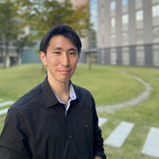

# オープニングの挨拶

Google Developer Group - DevFest Tokyo 2025 の オープニングを GDG Tokyo Organizer の Naoya が行います。また、冒頭では IPUT の学生の皆さんと作成したオープニングムービーが流れますので、お楽しみに！

## Speaker

### Naoya さん (@Getty708) / Google Developer Group Tokyo Organizer

ML Engineer 兼 GDG Tokyo Organizer。2021 年に「身近な課題をテクノロジーで解決する」をテーマに GDSC Osaka (現 GDGoC Osaka) を立ち上げ、学内部活との DX Project や Marketing Study Jam などの様々なプロジェクトをチームで企画・実行してきました。現在はその経験をもとに、GDG Tokyoの運営を行っています。

