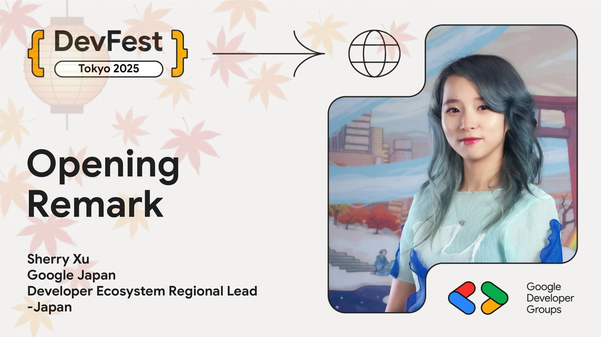

# Opening - Google デベロッパー コミュニティと共に成長しよう

Google DevRel 日本代表の Sherry Xu が、DevFest のオープニングを飾ります。2025 年に達成した日本のデベロッパープログラムの成果と、コミュニティ支援のための具体的なプログラムをご紹介いたします。また、参加者への特別なサプライズを発表します。さらに、今年は Google の超上級エグゼクティブからのスペシャルメッセージもございます。日本の開発者コミュニティの皆様に向けた、特別な激励のメッセージにどうぞご期待ください。

## Speaker

### Sherry Xu さん / Developer Ecosystem Regional Lead - Japan, Google Japan

SherryはGoogle JapanのDeveloper Ecosystem Regional Leadとして、日本のデベロッパーコミュニティの成長を牽引しています。Googleで7年以上にわたり、主にエンジニアリングとDEI（多様性、公平性、包括性）分野のプログラムマネージャーとして活躍してきました。中国で幼少期を過ごし、ニューヨークと東京でそれぞれ約3分の1の人生を送った国際的なバックグラウンドを持ち、2015年にニューヨークから東京に移住。また、デジタルアートのイラストレーターとして個展も開催するなど、テクノロジーとクリエイティビティの両面で多才な顔を持つSherryが、Googleのデベロッパーリレーションにおける最新の取り組みについて語ります。

