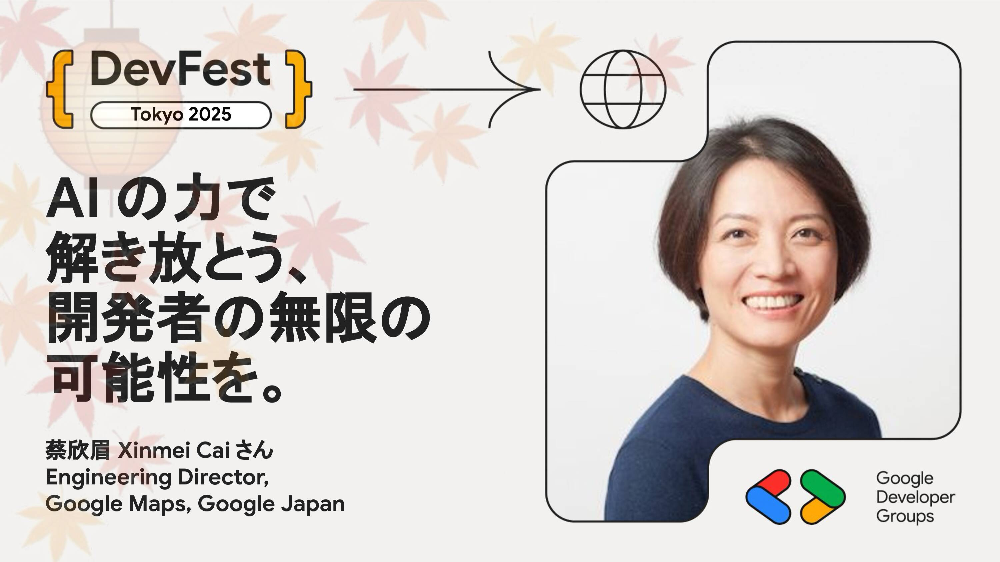

# AI の力で解き放とう、 開発者の無限の可能性を。

Unlock Developer’s Potential Together with the Power of AI

## Speaker

### 蔡欣眉 Xinmei Cai さん / Engineering Director, Google Maps, Google Japan

マイクロソフト社およびスタートアップで4年間ソフトウェアエンジニアとして勤務した後、2004年にGoogleに入社。AdWords国際決済システムのテックリードを経て、2007年に「エンジニア大使」として東京へ移籍。YouTube日本法人のエンジニアリング組織を立ち上げ、YouTube Mobile WebおよびSearchのグローバルチームを率いた。

2012年にGoogle マップチームに移り、受賞歴のあるiPhoneアプリのローンチ（2012年）およびAndroid/iOS全体の主要な再設計（2013年）においてエンジニアリングを主導。2015年からはUGC（ユーザー生成コンテンツ）チームをゼロから立ち上げ、世界で最も利用されるローカルレビュープラットフォームやローカルガイド プログラムの開発を成功させました。現在は、東京のテックエンジニアリングサイトを共同で率いています。

ミドルベリー大学にて学士号、Google在職中にカーネギーメロン大学にてソフトウェア工学修士号を取得。

