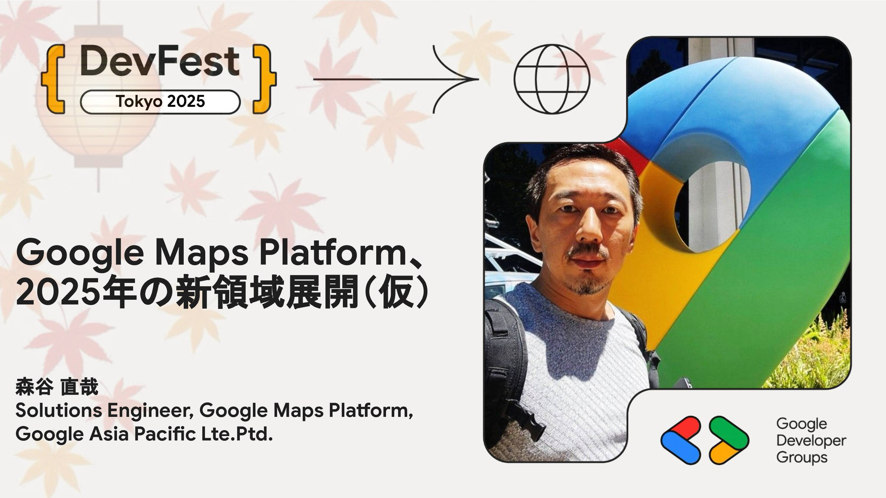

# Google Maps Platform、2025年の新領域展開

Google Mapsの機能を開発者向けに提供するGoogle Maps Platformにとって２０２５年はいくつもの新しい取り組みが形となる年になりました。その中でも２つのエリアについて触れたいと思います

１）データチームのためのGoogle Maps Platform：Google Mapsの豊富なデータを活用したいものの、利用規約上の制約に直面している開発者の方々の声に応え BigQueryを中心にGoogle Cloudと連携する新しい製品群が登場しました。データ活用の可能性を広げるこれらの新サービス（Places Insights等）をデモを交えてご紹介します。

２）開発者のための 生成AI＋Google Maps Platform：歴史が長い技術であるほど、インターネット上には多種多様な情報が散在し、有効かつ有用な情報を引き出すことはFoundation Model単体では困難です。そこでGoogle Maps Platformでは、最新のドキュメントやノウハウでコンテキストを拡張する開発支援MCPサービス Google Maps Platform Code Assist toolkit をリリースしました。活用例を交えてご紹介します。

## Speaker

### 森谷 直哉さん / Solutions Engineer, Google Maps Platform, Google Asia Pacific Lte.Ptd.

2011年3月よりGoogle Japanにて現Google Cloudのプリセールスを担当。東日本大震災で地図・空間情報の持つ力を目の当たりにし、Google MapsのAPIビジネスにも注力。2015年にシンガポールへ転籍し、東南アジアのクラウドビジネス立ち上げ、特にデータ活用分野におけるプリセールスに貢献。2022年より現職のGoogle Maps Platformの製品部門にて、主に早期製品を担当するソリューションエンジニアとして従事。

