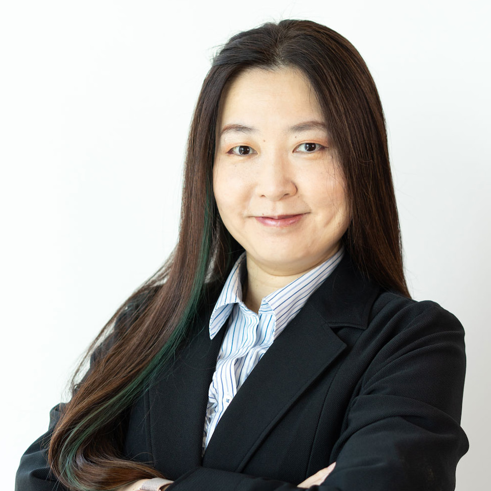
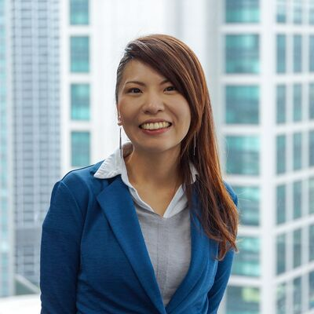
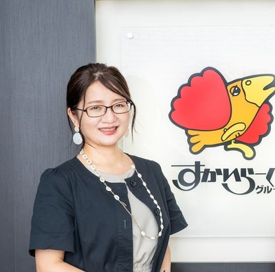
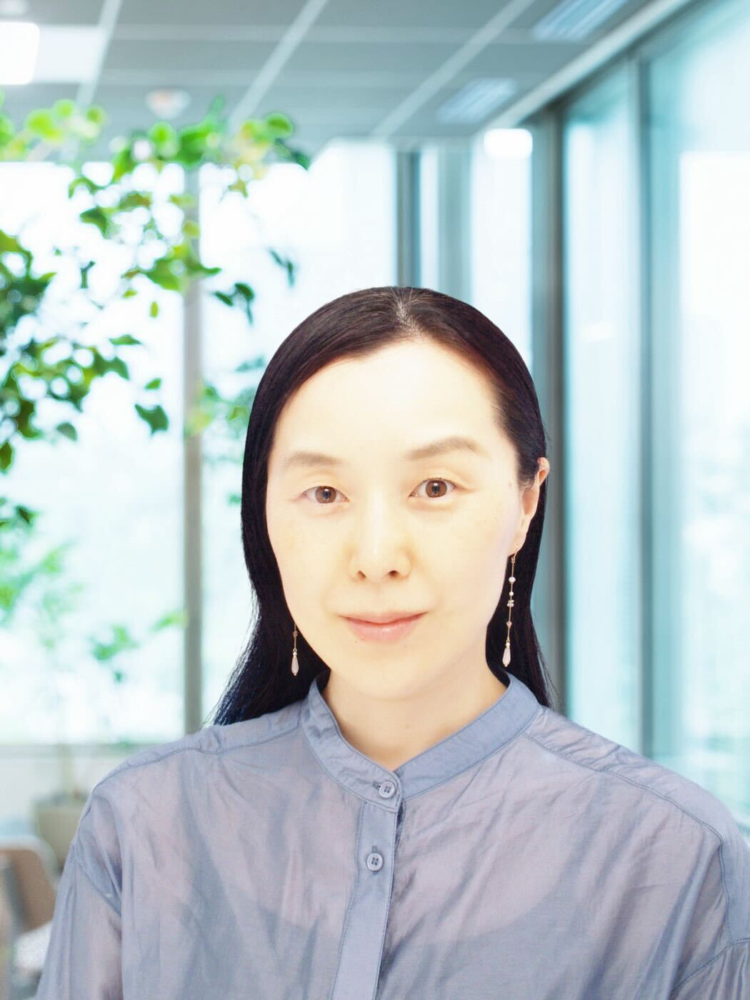

# フロンティア ~ 最先端＆ニッチな分野の技術たち ~

多岐にわたる Google のテクノロジーの中から、新しい分野・ニッチな分野のテクノロジーに焦点を当てたセッションです。Veo3 を使った動画作成から、Flutter を使った Liquid Glass エフェクト、そして Google オープンソースの半導体設計ソフトウェアという3つのトピックをお届けします。

あなたにとっての未知の領域に一緒に踏み込み、新しい視点を手に入れましょう！

## Session Chair Community

### ML女子部

機械学習やデータ分析をゆるく学ぶ会です。数ヶ月に1回程度AI/ML周りの勉強会イベントを開催しています。 初心者向けのグループなので，はじめての方でも大丈夫です！ ML/データ分析に興味ある方はぜひどなたでもご参加ください。 女性メンバー中心で運営しているグループですが、男性の参加もお待ちしてます♪

https://women-ml.connpass.com/

## Session Chair

### 伊藤清香 さん (@unerryito) / 株式会社unerry CTO

位置情報ビッグデータをベースに人流解析をする会社でCTOをしています。音声UI関連の書籍の執筆、ML女子部や「Jagu’e’r」のコミッティを務めるなど技術コミュニティにも参加。

### 福島 ゆかり さん (@fukku_island) / 株式会社電通デジタル マネージャー兼Google Cloud Evangelist

もっとマーケティングにGoogleのデータとAIとクラウドを使ってワクワクする！を後押しします！ GoogleCloud Partner Top Engineer 2024 data engineer、Google Developer Expert Cloud AI/ML&Data Analytics 、ML女子部コミュニティ運営、jaguar じゃがーる分科会運営、AI/ML分科会運営、GoogleCloud Next 23-25登壇等多数

### 藤本 祥恵 さん / 株式会社すかいらーくホールディングス メニューシステムデザインチーム

DX 推進担当として、データの民主化をテーマにダッシュボード開発等を実施。 社内 IT 勉強会「もくもく会」を発足メンバーとして勉強会を多数開催。 コミュニティ活動を積極的に実施しており、人材育成や小売業をテーマに活動し、人とともに成長することを目指す。

### 曲沼 宏美 さん (@Door_IntoSummer) / 株式会社インテージ DeputyDirector, InsightArchitect

広告代理店を経て IT ベンチャーで分析コンサルティングに従事。2006 年より CCC で提携先への T カードデータ分析コンサルや大学連携を担当。2012 年よりリクルートでデータ活用を推進。全社横断 PJ や CRM 分析など多数のプロジェクトに携わる。人材領域のアルゴリズム開発により全社表彰 ARINA ENGINE 受賞。2022 年よりインテージにてデータ活用を推進。Google Developer Experts　ML女子部オーガナイザ

