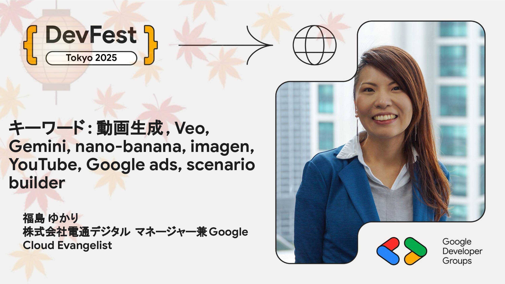

# キーワード: 動画生成, Veo, Gemini, nano-banana, imagen, YouTube, Google ads, scenario builder

Coming soon ...

## Speaker

### 福島 ゆかり さん (@fukku_island) / 株式会社電通デジタル マネージャー兼Google Cloud Evangelist

もっとマーケティングにGoogleのデータとAIとクラウドを使ってワクワクする！を後押しします！ GoogleCloud Partner Top Engineer 2024 data engineer、Google Developer Expert Cloud AI/ML&Data Analytics 、ML女子部コミュニティ運営、jaguar じゃがーる分科会運営、AI/ML分科会運営、GoogleCloud Next 23-25登壇等多数

