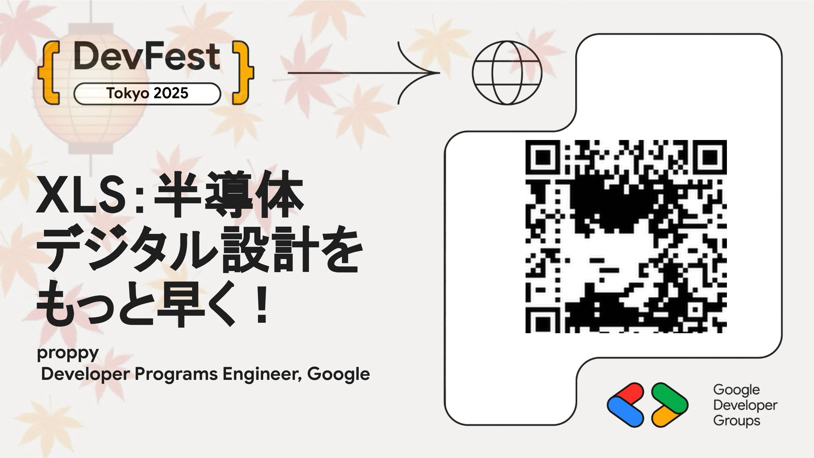

# XLS：半導体デジタル設計をもっと早く！

ライブデモしながら、XLSの中位合成ツールキットを紹介します：

- 🦀 Rust風のプログラミング言語
- ✅ テスト駆動ハードウェア開発
- 🎛️ 自動最適化のコンパイラー
- 🧑‍🔧 ソフトウェアとハードウェアの共同設計

こちらを通して半導体設計の高速化を目指します。

## Speaker

### proppy さん (@proppy) / Developer Programs Engineer, Google

グーグル東京でハードウェアツールチェーンを協力してます。

