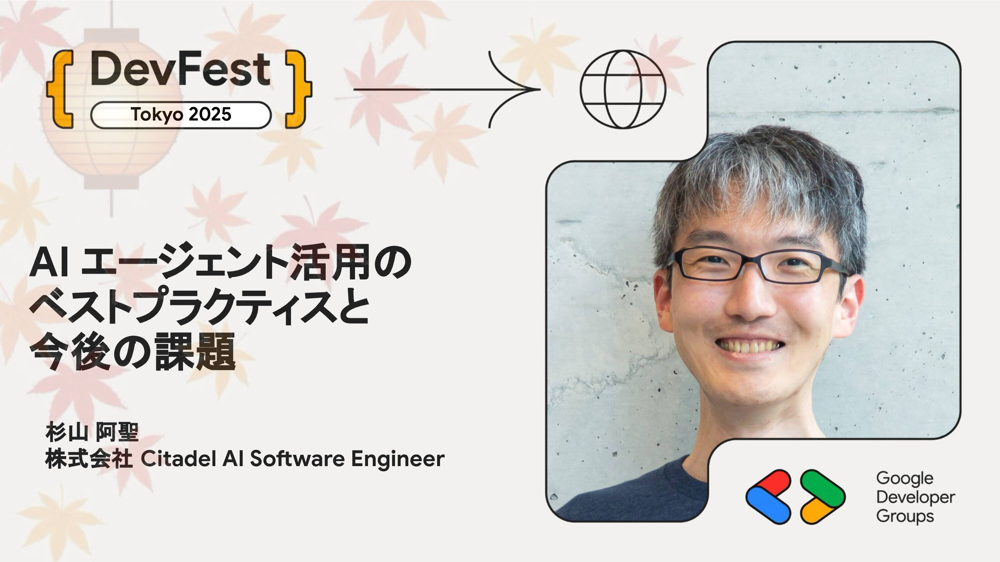

# AI エージェント活用のベストプラクティスと今後の課題

LLM 登場以降の AI に関する技術的な革新の速度は凄まじく、AI がない生活はもはや想像できなくなりました。AI エージェントのビジネスへの適用も進行していますが、さまざまな課題があることも事実です。ここではさまざまな企業へのヒアリングを通じて見えてきた AI エージェント開発の方法論と、AI セーフティ、AI ガバナンスの実践方法について概要をお伝えします。

## Speaker

### 杉山 阿聖 さん (@K_Ryuichirou) / 株式会社 Citadel AI Software Engineer

Citadel AI でプロダクト開発や AI セーフティに関する研究開発に従事。これまでに機械学習パイプラインの構築など、機械学習の実用化に取り組む。「機械学習図鑑」「事例でわかる MLOps」の共著者のひとり。Google Developers Expert (Google Cloud, AI)。

