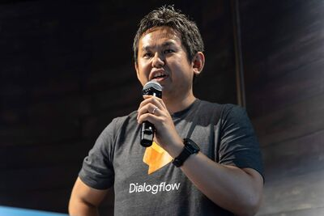
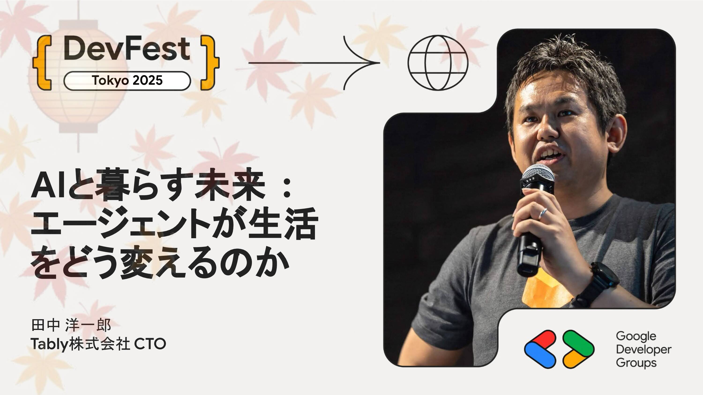

# AIと暮らす未来 : エージェントが生活をどう変えるのか

ここ数年で、AIは私たちの生活に一気に広がりました。文章や画像を生み出す生成AIは、既に日常のさまざまな場面で利用されています。そして次にやってくるのが「AIエージェント」の時代です。AIエージェントは、私たちがアプリを操作する代わりに、目的を伝えるだけで「考え、判断し、実行してくれる」存在です。買い物や旅行の計画、仕事の整理や情報収集など、これまで時間をかけていた作業をAIが引き受ける未来がすぐそこまで来ています。この講演では、「AIがここまで進化してきた流れ」「今のAIの仕組みとできること」「AIエージェントが実現する【ちょっと先の暮らし】」をわかりやすく解説します。

## Speaker

### 田中 洋一郎 さん (@yoichiro) / Tably株式会社 CTO

業務アプリ向けの開発ツールやフレームワークの設計に携わった後、mixi Platform、LINE Platformの技術統括を行い、日本でのソーシャルアプリケーションの技術的な基礎を確立しただけでなく、メッセージングアプリにおいても世界に先駆けてBOT Platformの立ち上げを主導した。現在はAIを駆使したサービスの開発を行っている。Google Developers Expert (Web Technology担当)。電子情報通信学会 東北支部学生員奨励賞受賞。Mash up Award 3rd 3部門同時受賞。モバイルプロジェクト・アワード2010 モバイルプラットフォーム部門優秀賞受賞。著書『ソーシャルアプリプラットフォーム構築技法』など。

