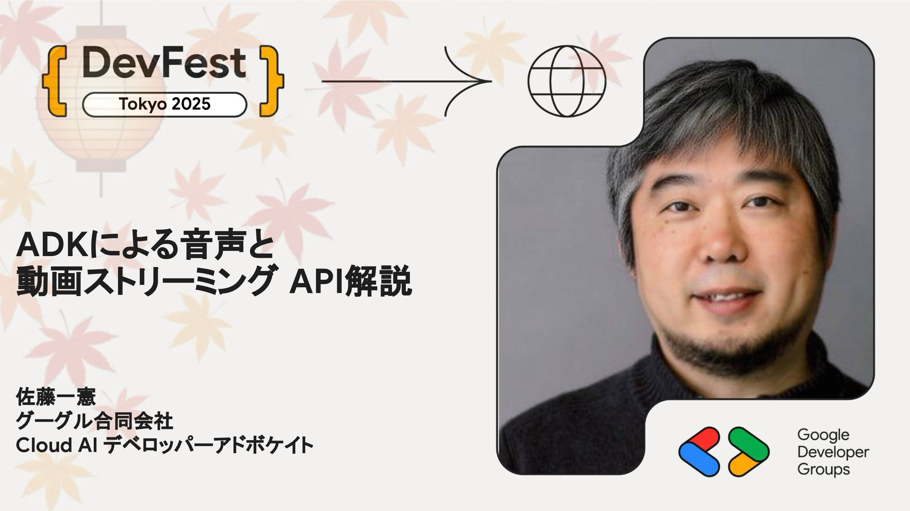

# ADKによる音声と動画ストリーミングAPI解説

ADKにおいて音声や動画によるストリーミング機能を提供するBidi-streamingの使い方や勘所を解説します。API設計、Gemini Live APIとの関係、実際のストリーミングアプリ開発のtips等を紹介します。

## Speaker

### 佐藤一憲 さん (@kazunori_279) / グーグル合同会社 Cloud AI デベロッパーアドボケイト

Google Cloud AIチームのデベロッパーアドボケイトとしてGoogle Cloud USブログ記事やドキュメントの執筆、デモ開発等を担当。2016年より25件以上を掲載し、ジェフディーン、エリックシュミット、ニューズウィーク誌、ニューヨーカー誌により紹介された。延べ17か国のイベントで講演し、Google I/OやCloud Nextにも例年登壇。Xでは2万人のフォロワーに向けてAI/MLの情報を日々共有している。

