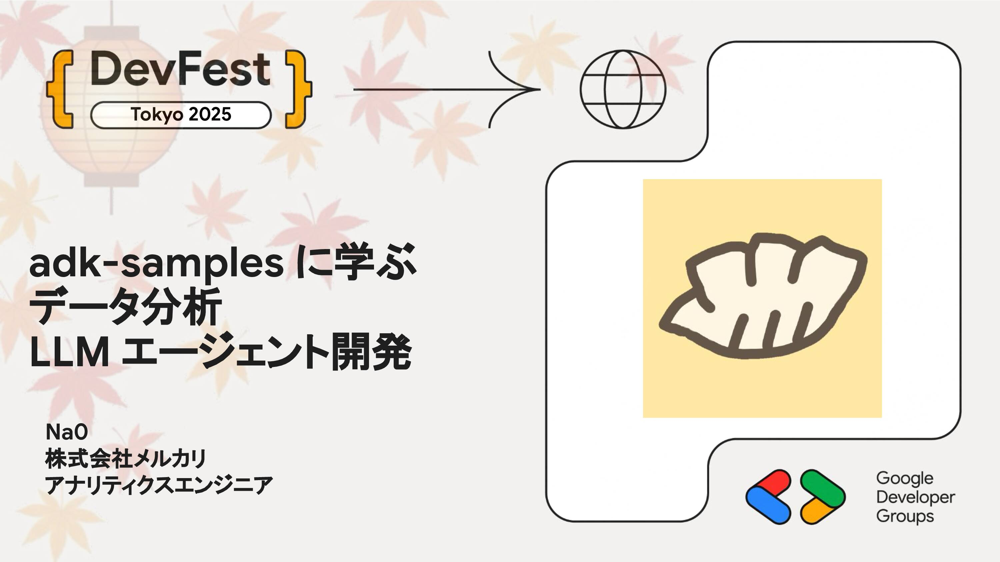

# adk-samples に学ぶデータ分析 LLM エージェント開発

Google ADK を使った開発、迷いませんか？本セッションでは、公式サンプルリポジトリ adk-samples を起点に、実践的なデータ分析エージェントを構築するための開発レシピを解説します。自然言語による SQL の作成、安全な BigQuery クエリの実行、認証認可の組み込みといった一連の流れをサンプルコードに沿って紹介します

## Speaker

### na0 さん (@na0fu3y) / 株式会社メルカリ アナリティクスエンジニア

2022 年にメルカリに入社し、データ基盤や A/B テスト基盤の改善を通してデータ利活用の推進に貢献。現在は、生成 AI を活用したデータ分析エージェントの開発をリードし、全社員がデータ分析にハードルを感じることなくデータを活用できる環境の整備に取り組む。

