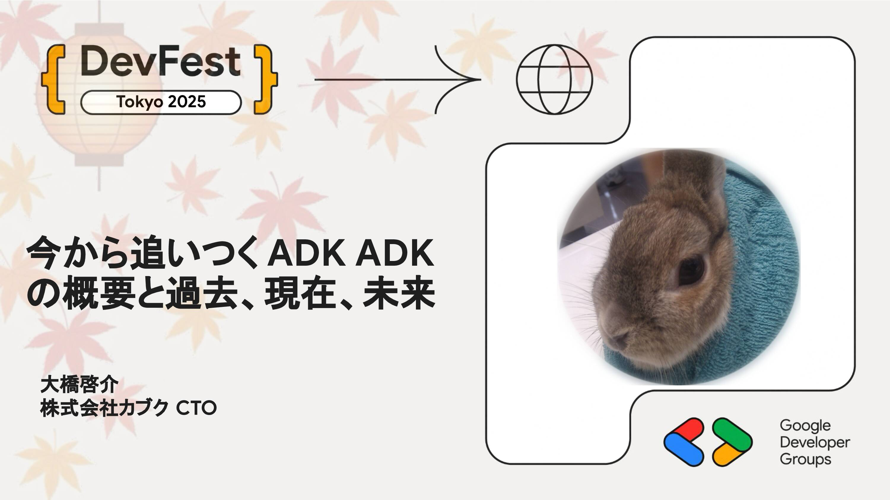

# 今から追いつくADK 〜 ADKの概要と過去、現在、未来 〜

本セッションでは、これからAI Agentを作ろうと思っている方や、ADKをより深く知りたい方向けに、「今から追いつくADK」として、Agent Development Kitについての概要と、これまでのコミットログやリリースノートから見る過去、現在、そしてロードマップから見る未来について話して行きます。

## Speaker

### 大橋啓介 さん (@soundTricker318) / 株式会社カブク CTO

Workspace、Google Cloud、Angular、GASの人 一応Google Developer Expert(Workspace)です。最近はADKをいっぱい触っています。

