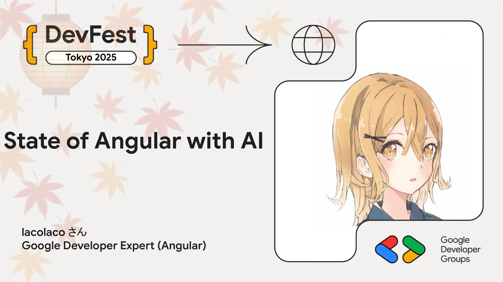

# State of Angular with AI

2025年のAngularは、機能面での進化だけでなく、AI志向のプラットフォームとしても大きく飛躍しました。今年のアップデートをかいつまんで紹介しつつ、"Angular with AI"に焦点を当てた今後の展望をお話します。...

## Speaker

### lacolaco さん (@laco2net) / Google Developer Expert (Angular)

Google Developers Expert for Angular。Angularを中心にWeb周辺のオープンソースコミュニティでコントリビューションや翻訳、登壇、イベント主催などの活動をしています。『JavaScript Primer』共著者。ポッドキャスト「リファクタリングとともに生きるラジオ」でも活動中。

