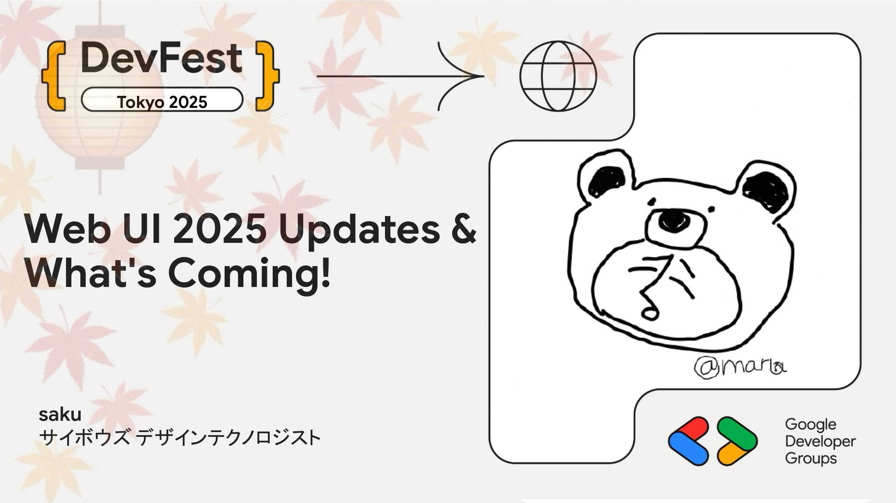

# Web UI 2025 Updates & What's Coming!

よりパワフルで柔軟な UI を実現する Web の機能が、今年も多く登場しました。

そんな 2025年の Web UI を取り巻く HTML&CSS&JS 機能のアップデートと、今後登場が期待される機能をご紹介します。

## Speaker

### saku さん (@sakupi01) / サイボウズ デザインテクノロジスト

ウェブの UI 周りの技術動向を追っています。Focusing on all things VISUAL on Web Platform! Design Technologist @Cybozu.

