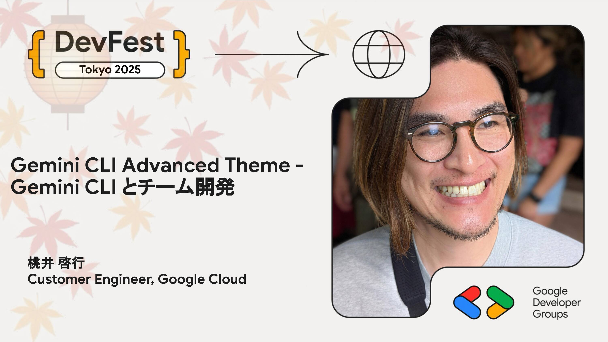

# Gemini CLI Advanced Theme - Gemini CLI とチーム開発

[先日の Vibe Coding セッション](https://gdgkwansai.connpass.com/event/364586/) でご紹介した内容、開発者個人からみた Gemini CLI の話を軽くおさらいした上で、視点を拡大し、組織・チームとしてエンタープライズ開発を行っていくための Gemini CLI 関連の情報を提供しながらみなさまと知見を深めていきたいと思います。

## Speaker

### 桃井 啓行 さん (@hiro038482) / Customer Engineer, Google Cloud

Google Cloud のカスタマーエンジニアとして、Google Cloud Platform の技術サポートを担当しています。お客様のクラウドシステム構築を支援するため、新サービスやソリューションの紹介、アーキテクチャ設計、PoC 支援などを幅広く手掛けています。最近は、Gemini などの生成 AI モデルや ADK、Agent Engine といった最新技術の導入支援にも力を入れています。

