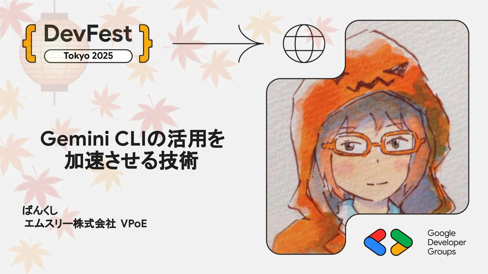

# Gemini CLIの活用を加速させる技術

この2年程で、プロダクト開発や企業活動の中でAI技術を利用しない日は無くなりつつあります。 同時に、確率的な挙動を持つツールを確定的な業務で扱う難しさも急速に広まっています。 本セッションでは、古典的なMLOpsの考え方に触れながら、AI Agent/CLIツールの活用を中心にAIの信頼性や整合性を高めながら開発および業務を加速させていく技術を紹介します。

## Speaker

### ばんくし さん (@vaaaaanquish) / エムスリー株式会社 VPoE

機械学習エンジニアとしてスタートアップ、メガベンチャーを経験した後、エムスリー株式会社に入社。2023年よりVice President of Engineering。株式会社ElithやPIVOT株式会社 にてTechnical Advisorを務める。OSSや技術登壇の実績が認められ、2023年にGoogle Cloud Developer Experts (AI/ML)に就任。

