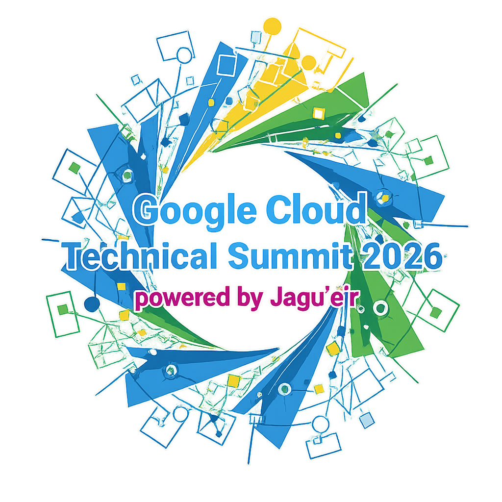

# 生成 AI と社会をつなぐデータ活用最前線

本セッションでは、 「オブザーバビリティ」・「ダッシュボード」・「Kaggle」という 3つの技術トピックを取り上げ、生成 AI 時代におけるデータ活用の最前線を各分野のエキスパートからご紹介いただきます。

最初の「オブザーバビリティ」 では、AI エージェントの振る舞いを理解するのためのシステムデータの活用方法をご紹介します。次に「ダッシュボード」からは、デジタル庁が公開する「政策ダッシュボード」の開発経験から行政データを活用するポイントや想定課題を議論します。そして最後に、世界的に有名な機械学習のコンペサイト「Kaggle」を通して生成 AI 時代における変化を反映した学びについてお話しいただきます。

## Session Chair Community

### Google Cloud Technical Summit

Google Cloud Technical Summit 2026 は Google Cloud ユーザーコミュニティ Jagu'e'r が主催となり、「超 Google Cloud 特化」と「新たなコミュニティとの出会い」をテーマに来年2月に初めて開催される Google Cloud のオンライン技術カンファレンスです。Jagu'e'r をはじめ、複数の Google Cloud 関連コミュニティメンバーと Google Cloud の技術について語り尽くしましょう！ https://2026.gcts.jp/

## Session Chair

### 木村健人 さん (@AoToLog\_) / Datadog Japan 合同会社 Sales Engineer

Datadog Japanのセールスエンジニアとして、オブザーバビリティ導入の技術支援を担当。コミュニティ活動は Google Cloud 公式ユーザーグループ「Jagu'e'r」でオブザーバビリティ分科会 / クラウドネイティブ分科会 / Tech Writers 分科会 / 月末 Tech Lunch / Next × Jagu'e'r Meetup、Japan Datadog User Group(JDDUG)、Google Cloud Technical Summit など。Google Cloud Partner Top Engineer 2023-25 / AWS Community Builder(Cloud Operations) / Jagu'e'r Award 優秀賞 2023-24

