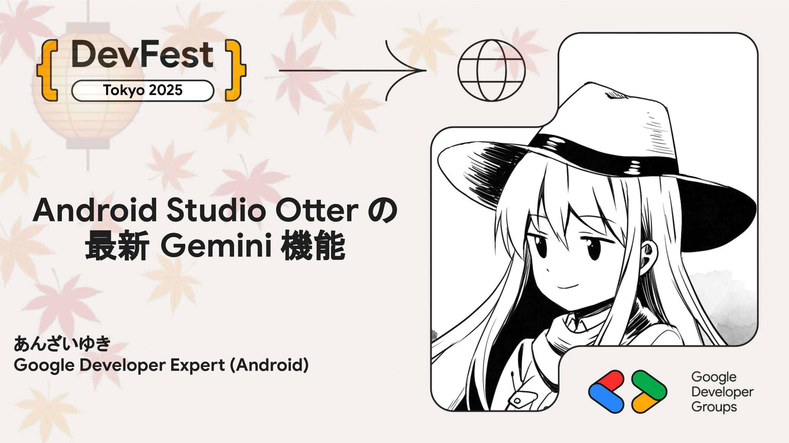

# Android Studio Otter の最新 Gemini 機能

Android Studio には内蔵の Gemini AI ツールが組み込まれています。次の Android Studio のバージョンである Otter での Gemini ツールの最新機能を紹介します。

## Speaker

### あんざいゆき さん (@yanzm) / Google Developer Expert for Android

Android の GDE です。Kotlin 大好き。AI ツールでいろいろ遊んでます。最近は Agent Development Kit で AI エージェント作るのが楽しいです。

