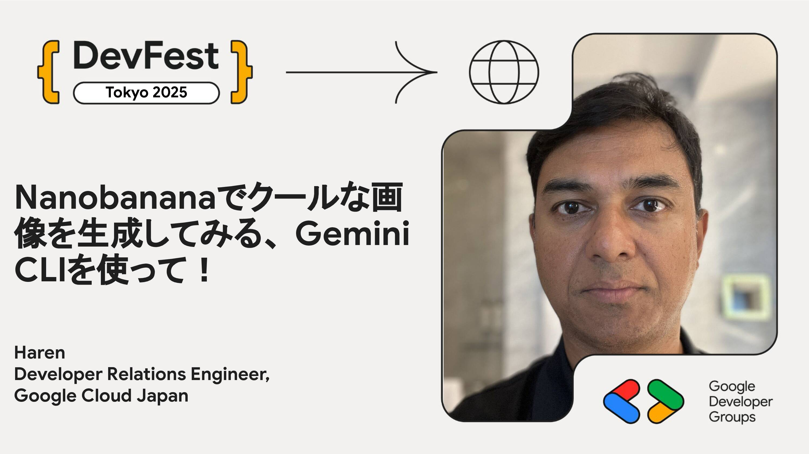

# Nanobananaでクールな画像を生成してみる、Gemini CLIを使って！

このセッションではGemini CLIの基本的な使い方を学び簡単なタスク実行するハンズオンを行います。そして、Gemini Extensionsを使ってGemini CLIでNanobananaモデルを使えるようにしてクールな画像を生成、編集します。

準備：当日自分のパソコンを持参ください。提供される無償クレジットを事前に適用するとセッションがスムーズに進みます。

## Speaker

### Haren さん (@HarenB16221) / Developer Relations Engineer, Google Cloud Japan

シニア デベロッパー リレーションズ エンジニアのバンダリ・ハレン (Bhandari Haren) です。主にGoogle Cloud (GCP) のAI関連サービスをご活用いただくためのハンズオンセッション、コードサンプル、ブログ記事などを開発者の皆様へお届けしています。

