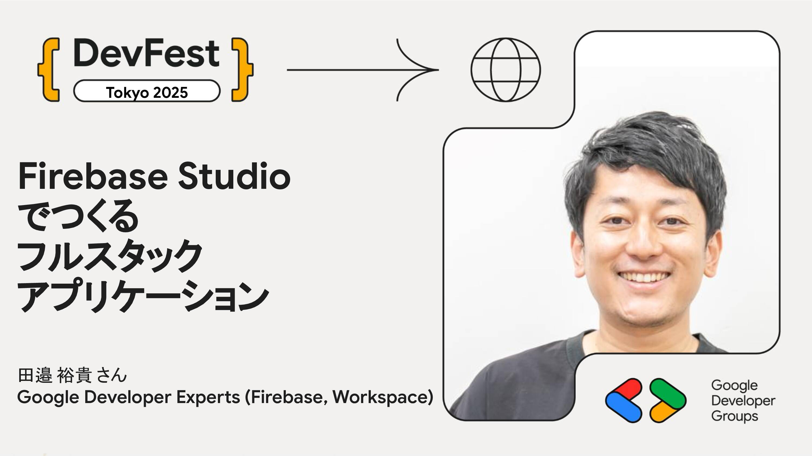

# Firebase Studio でつくるフルスタックアプリケーション

Firebase Studio は、フロントエンド・バックエンド・データベースの構築を一元的に行える新しい開発環境です。このハンズオンでは、Firebase Studio を使ってフルスタックアプリケーションを実際に構築しながら、Firestore や Firebase Authentication、Firebase App Hosting などの主要機能を体験します。

## Speaker

### 田邉 裕貴 さん (@\_tanabee) / Google Developer Experts (Firebase, Workspace)

新卒でヤフーに入社し、新規アプリ起ち上げやヤフー地図アプリのリニューアルなどを経験。その後 VR スタートアップ起ち上げや受託開発会社起ち上げなどを経て、現在は医療系ベンチャーで VPoE を務める。Google Developers Expert として Firebase, Workspace 関連技術のエバンジェリストとして活動中。プライベートのアプリ開発では 100 万ダウンロード達成。

