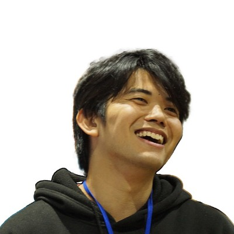

# [LT]「即戦力」を考える：システムUIを2週間でWeb/Appを同時展開してみた & まだキーボード使って開発？古いよ笑 〜指の運動、そろそろ卒業しません？〜

**「即戦力」を考える：システムUIを2週間でWeb/Appを同時展開してみた**

なぜ私たちは今も指でコーディングしているのでしょうか？今回は、視線・音声・AIを組み合わせた新しい直感的な開発環境のコンセプトを紹介します。 キーボードに依存しない、より自然で人間らしいコーディングの可能性を探ります。 また、マルチモーダルな開発環境がもたらす未来の開発体験についても少し考察します。

## Speaker

### 砂川優治 さん / 名古屋国際工科専門職大学 学生

名古屋国際工科専門職大学 工科学部 情報工学科 IoTシステムコース３年の砂川優治（Yuji Sunagawa）です。８年間ブラジルに住んでいた経験と、今学んでいる情報技術を活用して、多文化共生に貢献する方法を模索しています。

### sota さん / 名古屋国際工科専門職大学 学生

学生で就活中なので、いいご縁があるといいなと思っています！

