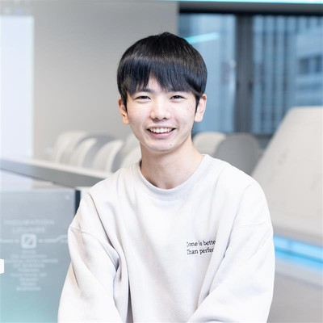

# AR × Android OS で描く高齢者介護のビジョン駆動型デザイン（仮）

XR技術を用いた万博展示を経て、 ARグラス装着者だけに閉じがちな視界を、マネキンやモニター等を用いて同期演出を行い、周囲の来場者とどのように共有したのかを紹介する。 コンセプト設計から、プロトタイピング、体験型展示ならではの工夫と学びまでを、体験談ベースで語る。

## Speaker

### 高橋 和輝 さん (@nogikun\_) / 大阪国際工科専門職大学 工科学部 情報工学科 AI戦略コース 4年, 学生

プログラミングが趣味な大学生です。LLMやXRなどの先端技術に興味があります。

