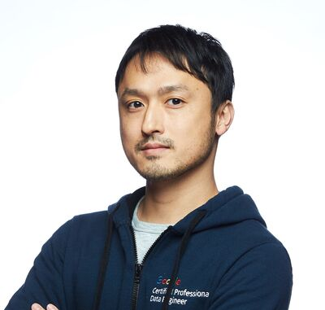

# 数理最適化MCPをつくったよ！

## Speaker

### おおたまん さん (@ohtaman) / Machine Learning Engineer, Ubie, Inc.

医療系スタートアップ Ubie の機械学習エンジニアです。Google Developers Expert（ML/AI）としても活動していたり、数理最適化のコミュニティ Casual Optimization の運営をしたりもしています。

