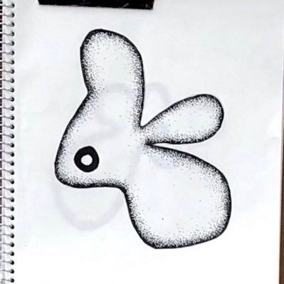

# [LT] プロダクトの死角をなくす技術としての多様性

私たちエンジニアは、時に意図せずプロダクトに死角を作ってしまうことがあります。 なぜ「多様性」や「インクルージョン」の視点が、AIやソフトウェアの品質向上という技術的課題の解決に不可欠なのか。 本LTでは、事例を交えながら、より多くの人に届く堅牢なプロダクトを作るヒントを一緒に探ります。

## Speaker

### Suuさん(@suueng) / お茶の水女子大学 バックエンドエンジニア

普段はNPO法人Waffleという団体で女性エンジニア学生を増やす取り組みをする傍ら、自分自身も学生エンジニアを4年弱行っています。最近の学生はどのように技術をキャッチアップしているのか？というのを中心にお話しできればと思います。

