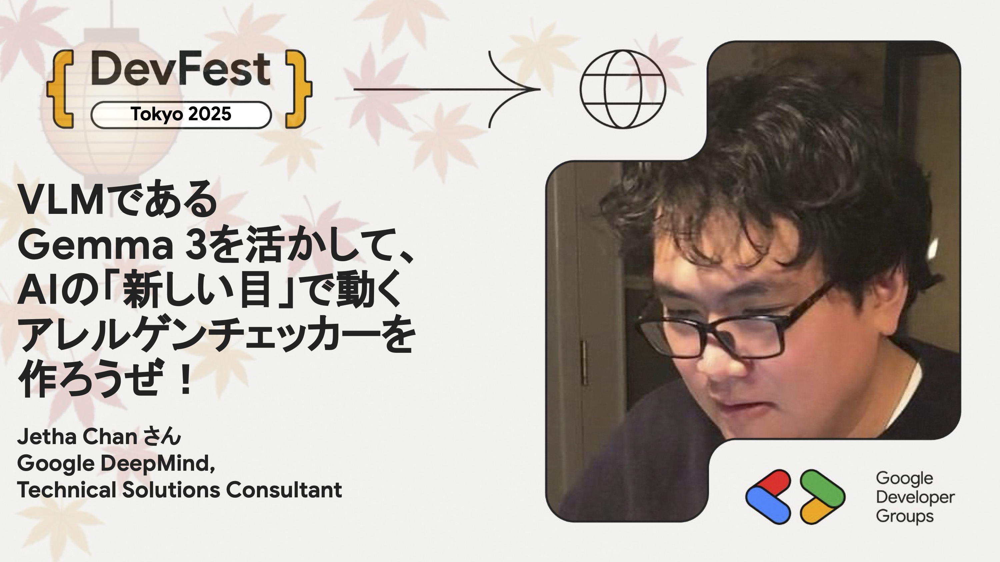

# VLMであるGemma 3を活かして、AIの「新しい目」で動くアレルゲンチェッカーを作ろうぜ！

Gemma 3（マルチモーダル VLM）を使って、食品パッケージ画像 × 個人アレルギー情報 → 安全判定を行うアレルゲンチェッカーを作成します。

Codelab を利用し、Gemma の画像理解・プロンプト改善・推論ロジック設計を体験できます。

注意: AI による判定は常に正しいとは限りません。判定の正確性を保証するものではなく、人によるダブルチェックが必要です。

注意: Hands-on Sessionは事前登録制です。[こちらのページ](https://gdg-tokyo.connpass.com/event/375360/) より事前登録をお願いいたします。

## Speaker

### Jetha Chan さん (@jetha) / Google DeepMind, Technical Solutions Consultant

