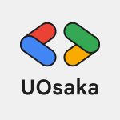
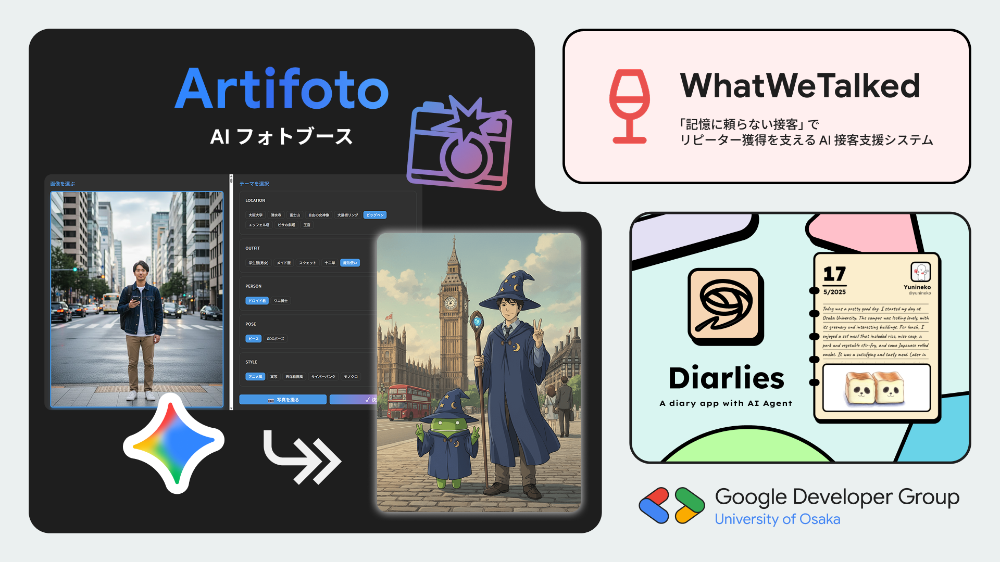

# [DEMO] GDGoC Osaka 作品展

### Artifoto ～AI フォトブース powered by Nano Banana～

Google AI 搭載の近未来的なフォトブースを体験しよう 📸 阪大の大学祭でたくさんの方に体験いただいた「AI フォトブース」が、東京にも登場！Google の AI「Gemini」のモデルの 1 つであるNano Banana は高性能な画像生成ができます ✨ まずはフォトブースで写真を撮り、服装や背景、画風などの選択肢を選んで、あなただけの特別な 1 枚を作りましょう！ どんな写真ができるかはお楽しみに！

### Diarlies --- AI が自動で日記と絵を創り出す、新時代の日記アプリ

APAC Solution Challenge '25 に参加したプロジェクトです！AIがあなたのマルチメディア情報から出来事や感情を読み解き、日記文章と絵を自動生成。忙しいあなたも、書くのが苦手なあなたも、Diarlies なら手軽に楽しく続けられます。

### WhatWeTalked --- AIと顔認証技術を組み合わせた顧客支援システム

第2回 AI Agent Hackathon with Google Cloud に参加したプロジェクトです！私たちが外食をする回数のうち 77.5％ はリピート利用。小規模な飲食店では、常連客に「自分は特別に扱われている」と感じてもらうことが、再来店につながる大切なポイントです。しかし、この “特別感” を継続的に提供するには、一人ひとりの顧客情報を丁寧に記録・共有する仕組みが欠かせません。このシステムは、これまでスタッフ個人の記憶に頼っていた常連客の情報を店舗全体で活用できる「資産」として蓄積・活用する仕組みを提供します。

## Speaker

### GDG on Campus University of Osaka

GDGoC Osaka は、これまでの活動で開発してきた 3 つのプロジェクトを主に展示します！

