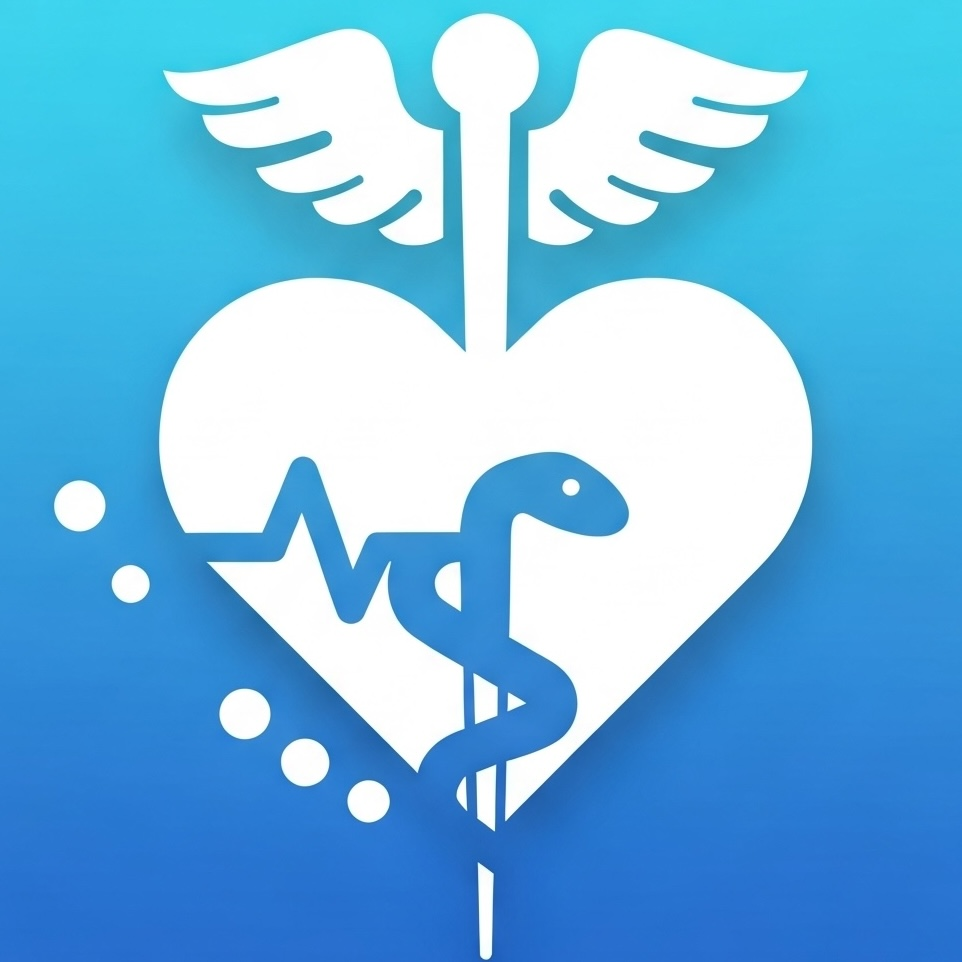
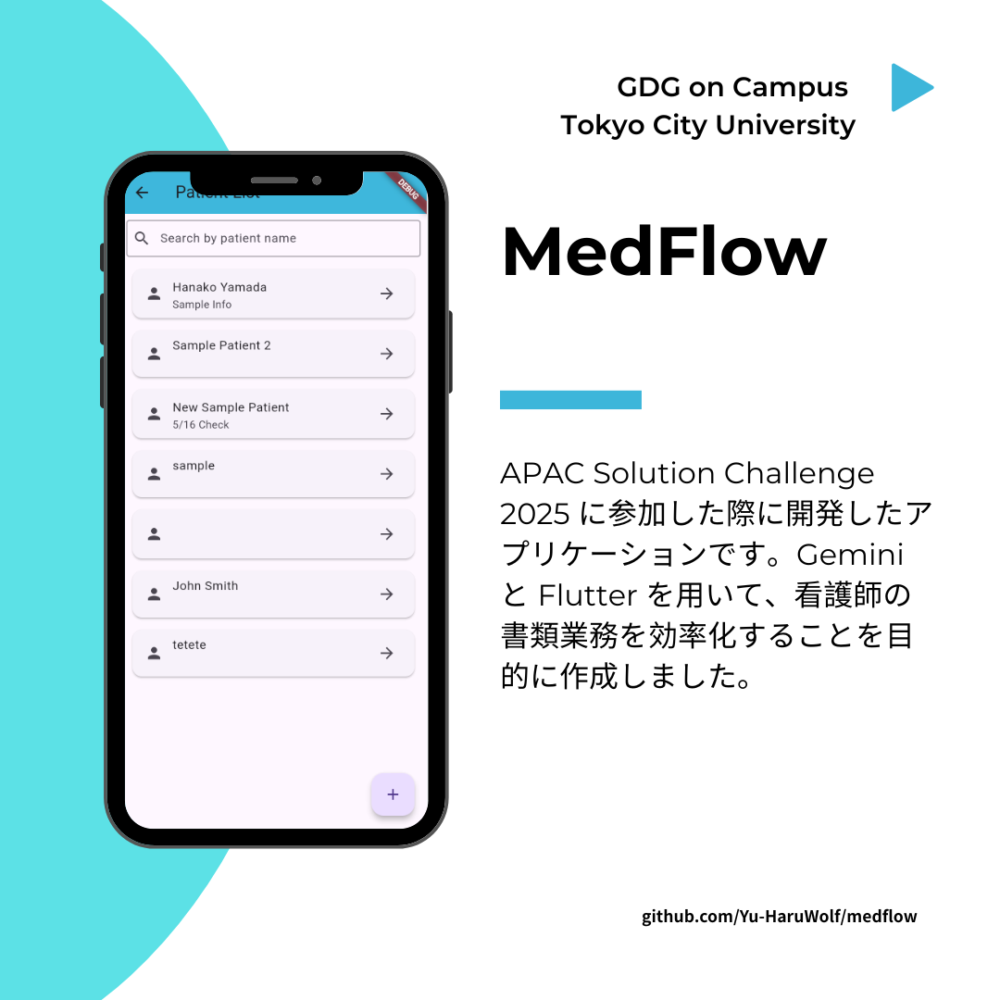

# Medflow (Gemini x flutter x 看護師)

APAC Solution Challenge 2025 に参加した際に開発したアプリケーションです。Gemini と Flutter を用いて、看護師の書類業務を効率化することを目的に作成しました。

## Speaker

### GDGoC TCU / Google Developer Groups on Campus Tokyo City University

私たちは「課題解決のためのプロダクトをチームで完成させること」を目標に、様々なイベントを開催しています！

