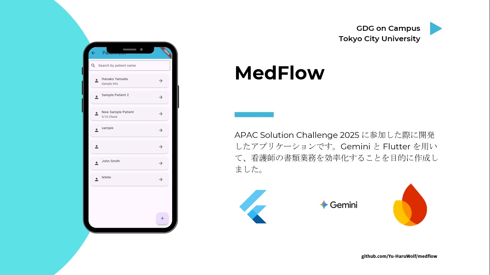

# Medflow (Gemini x flutter x 看護師)

近年、看護師の業務量は増加の一途をたどっており、医療現場において欠かせない存在である一方、その負担は非常に大きいものとなっています。特に書類業務は全体の20〜30％を占めており、入院患者の退院までを見据えた看護計画の作成や、毎日の患者状態を記録する SOAP など、多くの時間と労力を要しています。

看護計画は、同じ症状であっても患者の年齢・職業などにより最適な内容が異なるため、個別最適化された計画の作成が求められます。

そこで私たちは、Gemini × Flutter を活用し、看護師の書類業務を効率化するアプリケーションを開発しました。本アプリケーションにより、書類作成に関わる負担を軽減できるだけでなく、患者一人ひとりにより寄り添った看護の実現にも寄与できると考えています。

なお、本プロジェクトは APAC Solution Challenge 2025 において Top 10% に選出されました。

- GitHubリンク → [https://github.com/Yu-HaruWolf/medflow](https://github.com/Yu-HaruWolf/medflow)
- デモ動画 → [https://youtu.be/Qm7yatYSMqU](https://youtu.be/Qm7yatYSMqU)

## Speaker

### GDGoC TCU / Google Developer Groups on Campus Tokyo City University

私たちは学生向けコミュニティプログラム「Google Developer Groups on Campus」の1チャプター(拠点)として、東京都市大学の学生を中心に活動を行っているコミュニティです。「課題解決のためのプロダクトをチームで完成させること」を目標に、様々なイベントを開催しています！FlutterなどのGoogleに関連した技術の勉強会だけでなく、PythonやGitといった基礎的な技術の勉強会も実施することで、これまで技術に関して触れてこなかった学生でも、技術を用いて課題解決のためのプロダクトを作れるようになることを目指しています。

また、他のGDGチャプターや大学と協力し、Google オフィスや大学の教室をお借りして合同のハッカソンや展示会といったイベントを開催することもあります。GDGoC TCUは東京都市大学生だけでなく、他大学の学生が参加可能なイベントを多く開催しています！過去に開催されたイベントを詳しく知りたい方や今後のイベントに参加されたい方はぜひこちらのページをご確認ください！

- [https://gdg.community.dev/gdg-on-campus-tokyo-city-university-tokyo-japan/](https://gdg.community.dev/gdg-on-campus-tokyo-city-university-tokyo-japan/)

