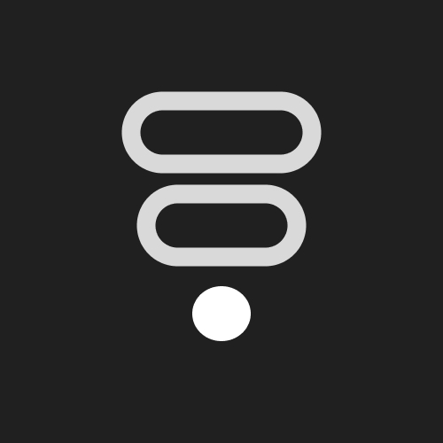
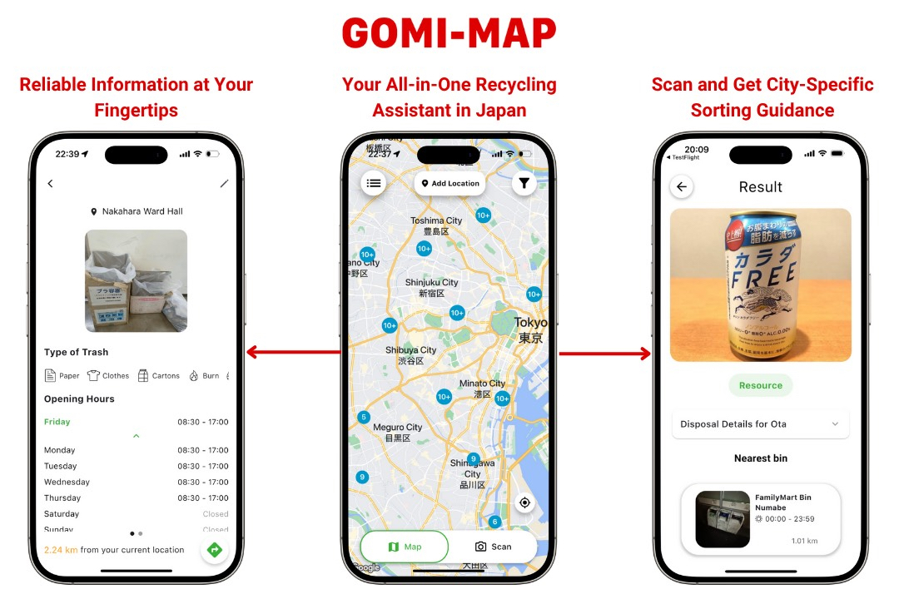

# [DEMO] GomiMap

日本では自治体ごとにごみの分別ルールが異なり、特に外国人居住者にとっては理解が難しいという課題があります。 GomiMap は、こうした課題を解決するために開発された多言語対応のごみ分別支援アプリです。Flutter と Firebase を活用し、ユーザーの位置情報から自治体ごとの分別ルールや収集日を自動表示。さらに、AI画像認識によるごみ分類補助機能を搭載し、直感的にごみ出しを行えるようにしました。

また、地方自治体や民間企業と連携し、自治体と市民がリサイクルに関する情報を共有できる API 基盤の整備を進めています。

本プロジェクトは Google Solution Challenge 2023 にて世界 Top 100 に選出され、社会的インパクトと技術力の両面で高く評価を受けました。今後も GDG コミュニティと共に、テクノロジーを通じて持続可能社会の実現に貢献してまいります！

## Speaker

### GDGoC Waseda / Google Developer Groups on Campus Waseda University

Google Developer Groups on Campus Waseda University (GDGoC Waseda)。早稲田からは過去にsolution challenge に参加した２つのプロジェクトを展示します。

