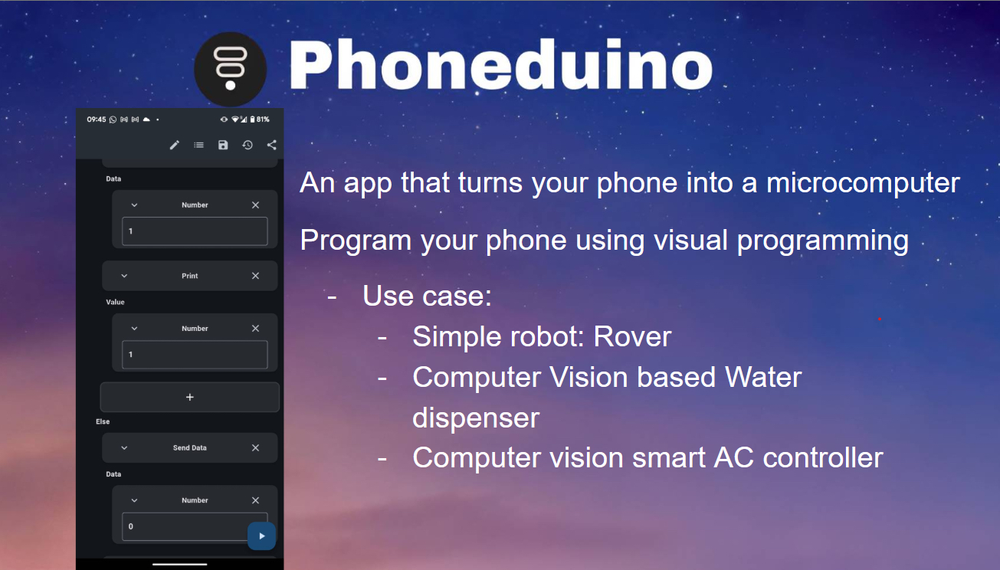

# Phoneduino

我々は誰でもロボットを作れる世界を作る、という目標を掲げ、スマートフォンをマイコンのように扱うためのアプリを開発しました。スマートフォンにはカメラを含む様々なセンサーが搭載されている上、ディスプレイやスピーカーなども備わっており、ロボット用のコンピュータとして非常に優秀な設計をしています。一からセンサーなどの配線をすることなくスマートフォンという既存のハードを使うことでロボット製作における金銭的、技術的ハードルを下げることに成功しました。 さらに、近年では古いスマートフォンの処理方法も問題となっています。このアプリを使い、古いスマートフォンをロボットに組み込むことでサステナビリティにも貢献することができると考えています。

本プロジェクトは Apac Solution Challenge 2025 にて世界 Top 10に選出され、6月のアジア開発銀行で開催されたdxフォーラムにてプレゼンを行いました。本イベントにおいても多くの方からフィードバックをいただけたらと思います！

## Speaker

### GDGoC Waseda / Google Developer Groups on Campus Waseda University

早稲田からは過去にsolution challenge に参加した２つのプロジェクトを展示します。

