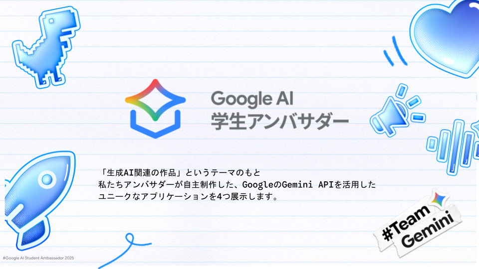

# [DEMO] Google AI 学生アンバサダー 作品展

こんにちは！ 私たち、Google AI 学生アンバサダーです！「生成AI関連の作品」というテーマのもと、私たちアンバサダーが自主制作した、GoogleのGemini APIを活用したユニークなアプリケーションを4つ展示します。学生ならではの視点で開発した、AIの「いま」と「これから」を感じられるデモをぜひ体験しに来てください！

## 展示作品ハイライト

当日は、以下の4つのアプリケーションを開発者本人がデモンストレーションします。

1. **論文から学ぶ英語教室（開発者: 名越 崇晃）** 「専門分野の論文を読みながら、効率よく英語も学びたい…」 そんな研究者や学生の悩みをGemini APIで解決！ 論文の内容をAIが解析し、あなた専用の英単語帳や学習サポートを提供します。
2. **Coreda（開発者: 大浦空）** 家族との会話をもっと安心・円滑に！ Gemini APIが攻撃的な言葉を検知し「やさしい言い換え」を提案、世代間ギャップも埋めるチャット＆共有アプリです。やさしさあふれるコミュニケーションを体験しませんか？。
3. **Gemini APIを用いた日報作成ツール（開発者: 白庄司 拓真）** エンジニアの皆さん、日報作成に時間を取られていませんか？ GitHubのコミット履歴や作業ログを連携するだけで、Gemini APIが体裁の整った「日報」を自動生成！ 面倒な作業はAIに任せて、開発に集中しましょう。
4. **Gemini APIを用いたDiscordツール（開発者: koki）** あなたのDiscordサーバーをもっと安心できる場所に！不適切な発言を検知する「AIモデレーション」と、AIが運勢を占い、占いに応じた画像を生成する「AI占い」など。Gemini APIを活用したDiscord Botを展示します。

当日は、私たちアンバサダー（5名）がブースに常駐し、皆さまからのご意見や技術的なフィードバックをお待ちしております！

## Speaker

### Google AI 学生アンバサダー

「Google AI 学生アンバサダープログラム」は、次世代の担い手である学生が、AIの安全かつ効果的な活用スキルを習得し、その知識を同世代に広めることで 、AIリテラシーの向上と、AIを活用した新たな価値創造を加速させます 。未来の社会全体でAIの恩恵を最大化することを目指し活動しています。

