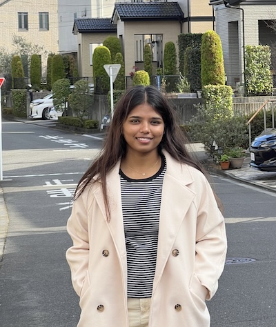

# [懇親会LT] Ideas to Innovation

An talk on AI and ML innovations and patents and how Google plays a role and impact every single innovation an inventor bring

## Speaker

### マラシ・ラマクリシュナン さん / Lead Software Engineer & Program Manager, Rakuten

I’m Malathi Ramakrishnan. I grew up in a rural village in Tamilnadu, India and studied in a Tamil-medium government school. With determination and a BTech IT scholarship in VIT University, I learned English and pursued my dreams, growing from my roots in India to building a career in technology across the globe, including Japan.

I’ve worked at Dell Technologies and currently at Rakuten, and I hold 44 U.S. patents. I’m passionate about innovation, and I love connecting with university graduates, business leaders, and fellow tech enthusiasts. It does not end here and I believe miles to go before I sleep!. I have been mentoring 40 children and for a couple of them helping financially for the education.

At DevFest Tokyo, I’ll be sharing my journey and insights in a lightning talk on innovation and Google’s impact, and I hope to inspire others to reach beyond boundaries, just as I did.

[https://www.linkedin.com/in/malathi-ramakrishnan-ab6482150](https://www.linkedin.com/in/malathi-ramakrishnan-ab6482150)

