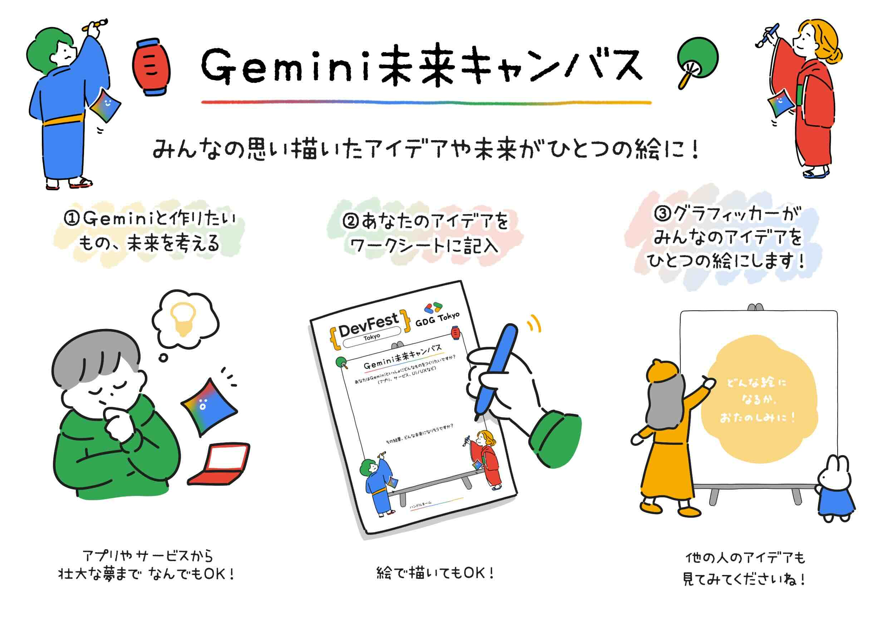

# [特別企画] 「Gemini 未来キャンバス」(ライブドローイング)

当日、皆様にご参加いただける企画として、ライブドローイング企画「Gemini 未来キャンバス」を開催します。 本企画では、Google の AI Gemini を使って、作りたいアプリやサービスなどのアイデアをご来場の皆様から募集します。そして、皆様の思い描く未来や夢をグラフィッカーの 春仲 萌絵 ( @harunaka_moe ) さんが、その場で大きなキャンバスに描いて 1つの作品にまとめて下さいます。 どんな作品に仕上がるのかは、参加者の皆様の想像力次第！ぜひ自由な発想で、様々なアイデアをお聞かせください！

- 注: 参加方法の詳細は、後日お知らせします。
- 注: 時間に制限があり、頂いたアイデア全てを絵にすることはできない可能性があります。あらかじめご了承ください。

