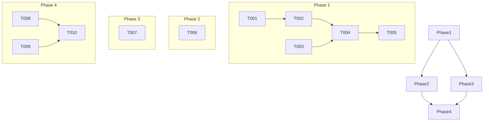

# Tasks: Data Schema Refactoring

- **Feature**: Data Schema Refactoring
- **Branch**: `006-data-schema-currently`
- **Spec**: [./spec.md](./spec.md)
- **Plan**: [./plan.md](./plan.md)

## Phase 1: Foundational Tasks

These tasks are the prerequisites for all other work. They must be completed before any user story can be implemented.

- **T001** [X]: Create the new data files in `src/data/`:
  - `src/data/speakers.json` (empty array)
  - `src/data/talks.json` (empty array)
  - `src/data/sessions.json` (empty array)
- **T002** [X]: Create a script `scripts/migrate-data.ts` to transform the data from the old `src/data/sessions.json` into the new structure and populate the new files. [P]
- **T003** [X]: Update the types in `src/types/index.ts` to reflect the new data model. The `Session` type should no longer contain nested `talks`, and `Talk` should no longer contain nested `speakers`. Instead, they should have `talk_id` and `speaker_ids` respectively. [P]
- **T004** [X]: Refactor `src/lib/data-parser.ts`. The `getSessions` function should now read from the three new JSON files and join the data to return the same `Session[]` structure as before. [P]
- **T005** [X]: Write a unit test for the refactored `getSessions` function in `tests/unit/lib/data-parser.test.ts`. This test should mock the new data files and assert that the function returns the correctly joined data.

## Phase 2: User Story 1 - Simplified Data Management (P1)

**Goal**: A data manager can easily manage speakers, talks, and sessions as separate entities.

**Independent Test**: A new speaker can be added to `speakers.json`, a new talk referencing the new speaker can be added to `talks.json`, and the application should display the new data correctly.

- **T006** [X] [US1]: Manually add a new speaker to `src/data/speakers.json` and a new talk to `src/data/talks.json` that uses the new speaker. Run the application and verify that the new talk and speaker are displayed correctly on the timetable.

---

## **CHECKPOINT**: User Story 1 is complete and independently testable.

## Phase 3: User Story 2 - Improved Developer Experience (P2)

**Goal**: A developer can query the data for speakers, talks, and sessions separately.

**Independent Test**: A developer can write a test that imports each of the new JSON files and asserts their contents.

- **T007** [X] [US2]: Write a new test file `tests/unit/data/data.test.ts` that imports `src/data/speakers.json`, `src/data/talks.json`, and `src/data/sessions.json` and asserts that each file contains an array of objects with the expected properties.

---

## **CHECKPOINT**: User Story 2 is complete and independently testable.

## Phase 4: Polish & Integration

- **T008** [X]: Refactor `src/app/timetable/page.tsx` to improve its structure and readability while ensuring it works correctly with the new data structure. [P]
- **T009** [X]: Refactor `src/app/talks/page.tsx` to improve its structure and readability while ensuring it works correctly with the new data structure. [P]
- **T010** [X]: Back up and remove the old `src/data/sessions.json` file.

## Dependencies

## Parallel Execution Examples

- **Phase 1**: `T002`, `T003`, and `T004` can be worked on in parallel after `T001` is complete.
- **Phase 4**: `T008` and `T009` can be worked on in parallel.

## Implementation Strategy

The implementation will follow an incremental approach. The foundational tasks will be completed first, ensuring the data is correctly migrated and the data parsing logic is updated. Then, each user story will be verified. Finally, the project will be cleaned up.

**MVP Scope**: The MVP for this feature is the completion of Phase 1, which includes the data migration and the refactoring of the data parsing logic.
